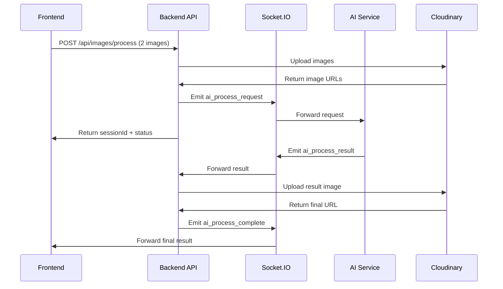

# GameTheBai Team 3 - Backend API

Backend API cho ứng dụng Game Thẻ Bài với tích hợp AI xử lý ảnh thông qua Socket.IO.

## 🚀 Tính năng chính

- **Authentication**: Đăng ký, đăng nhập với JWT
- **Image Processing**: Upload và xử lý ảnh với AI thông qua Socket.IO
- **Cloud Storage**: Tích hợp Cloudinary cho lưu trữ ảnh
- **Real-time Communication**: Socket.IO cho giao tiếp real-time với AI service
- **API Documentation**: Swagger UI tự động

## 🛠️ Công nghệ sử dụng

- **Backend**: Node.js, Express.js
- **Database**: MongoDB với Mongoose
- **Real-time**: Socket.IO
- **Cloud Storage**: Cloudinary
- **Authentication**: JWT, bcrypt
- **File Upload**: Multer
- **Documentation**: Swagger

## 📋 Yêu cầu hệ thống

- Node.js >= 14.x
- MongoDB
- NPM hoặc Yarn

## 🔧 Cài đặt

1. **Clone repository:**
```bash
git clone <repository-url>
cd GameTheBaiTeam3_Backend
```

2. **Cài đặt dependencies:**
```bash
npm install
```

3. **Cấu hình environment variables:**
Tạo file `.env` trong thư mục root với nội dung:
```env
# Database Configuration
MONGODB_URI=mongodb://localhost:27017/gamethebaiteam3

# JWT Configuration
JWT_SECRET=your_jwt_secret_key_here
JWT_EXPIRES_IN=7d

# Cloudinary Configuration
CLOUDINARY_CLOUD_NAME=dlyaaysfl
CLOUDINARY_API_KEY=174119572392813
CLOUDINARY_API_SECRET=Z-SA4H131tHy4WbHbbvoIOiqxG8

# Server Configuration
PORT=3000
```

4. **Khởi chạy server:**
```bash
# Development mode
npm run dev

# Production mode
npm start
```

## 🌐 API Endpoints

### Authentication
- `POST /auth/register` - Đăng ký tài khoản
- `POST /auth/login` - Đăng nhập

### Image Processing
- `POST /api/images/process` - Upload 2 ảnh để AI xử lý
- `POST /api/images/ai-result` - Endpoint cho AI gửi kết quả về
- `GET /api/images/status/:sessionId` - Kiểm tra trạng thái xử lý

### Documentation
- `GET /api-docs` - Swagger UI documentation

## 🔌 Socket.IO Events

### Client Events (Frontend)
- `connect` - Kết nối tới server
- `ai_process_complete` - Nhận kết quả xử lý từ AI
- `ai_process_error` - Nhận thông báo lỗi
- `ping` - Kiểm tra kết nối

### AI Service Events
- `ai_service_connected` - AI service thông báo kết nối
- `ai_process_request` - Nhận request xử lý ảnh từ API
- `ai_process_result` - Gửi kết quả xử lý về API

## 📸 Image Processing Flow

1. **Frontend gửi 2 ảnh** → `POST /api/images/process`
2. **API upload lên Cloudinary** và trả về `sessionId`
3. **API gửi URLs qua Socket** → AI Service
4. **AI Service xử lý** và trả kết quả qua Socket
5. **API upload kết quả lên Cloudinary** và gửi về Frontend



## 🧪 Testing

Sử dụng Swagger UI tại `http://localhost:3000/api-docs` để test các API endpoints.

### Test Image Processing:
1. Truy cập Swagger UI
2. Tìm endpoint `/api/images/process`
3. Upload 2 file ảnh (JPEG, PNG, GIF, WEBP)
4. Nhận `sessionId` và theo dõi kết quả qua Socket.IO

## 🏗️ Cấu trúc thư mục

```
src/
├── config/          # Cấu hình database
├── controllers/     # Logic xử lý requests
├── middlewares/     # Middleware functions
├── models/          # Database models
├── routes/          # API routes
├── services/        # Business logic services
├── utils/           # Utility functions
├── app.js          # Express app configuration
└── server.js       # Server entry point
```

## 🔐 Environment Variables

| Variable | Description | Example |
|----------|-------------|---------|
| `MONGODB_URI` | MongoDB connection string | `mongodb://localhost:27017/gamethebaiteam3` |
| `JWT_SECRET` | JWT secret key | `your_secret_key` |
| `JWT_EXPIRES_IN` | JWT expiration time | `7d` |
| `CLOUDINARY_CLOUD_NAME` | Cloudinary cloud name | `dlyaaysfl` |
| `CLOUDINARY_API_KEY` | Cloudinary API key | `174119572392813` |
| `CLOUDINARY_API_SECRET` | Cloudinary API secret | `Z-SA4H131tHy4WbHbbvoIOiqxG8` |
| `PORT` | Server port | `3000` |

## 🤝 Đóng góp

1. Fork project
2. Tạo feature branch (`git checkout -b feature/AmazingFeature`)
3. Commit changes (`git commit -m 'Add some AmazingFeature'`)
4. Push to branch (`git push origin feature/AmazingFeature`)
5. Tạo Pull Request

## 📞 Hỗ trợ

Nếu gặp vấn đề, vui lòng tạo issue trong repository hoặc liên hệ team.

## 📄 License

Distributed under the ISC License.
